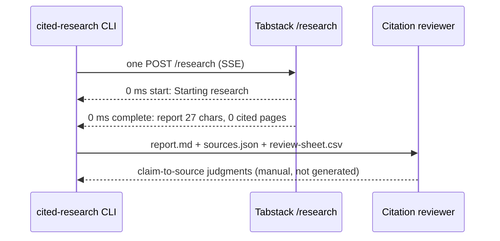

# Request lifecycle trace

Generated from `events.sanitized.jsonl`. Times are local monotonic milliseconds since
just before the request was sent. This is a **request lifecycle**, not a source-by-source
execution trace: progress events say what phase the service reports, not which page it
read. Only the `complete` event's `cited_pages` identifies sources.

## What this trace shows and does not show

| Observed (from the stream) | Not observable here |
|---|---|
| Event names, arrival order, local elapsed time | Which URL was fetched when |
| Allowlisted counters (iteration, urls_new, ...) | Model prompts or internal reasoning |
| Terminal state and report length | Retrieval passages behind each sentence |
| Cited pages in returned order | Whether a cited page supports a sentence |

Terminal state: `complete`. Review state: `review_needed_no_sources`.

## Cited pages (returned order)

Inline markers `[n]` in the report are joined to position `n` below. The SDK
documents `cited_pages` as ordered by first citation appearance; the public guide
does not say. The reviewer confirms the join.

| n | id | link | notes |
|---|---|---|---|
| - | - | no cited_pages returned | review needed |
